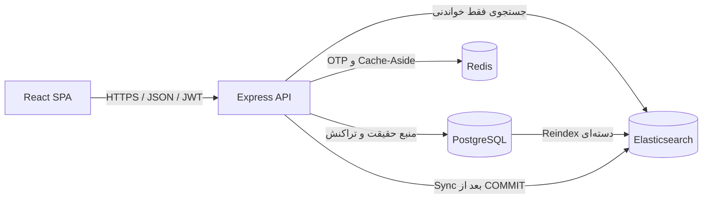

# معماری فاز چهارم

## اجزای اصلی



PostgreSQL تنها منبع معتبر رزرو، ظرفیت، پرداخت، کاربر و گزارش است. Elasticsearch
یک نمای غیرنرمال‌شده و قابل بازسازی از بلیت‌هاست و در هیچ تصمیم تراکنشی دخالت
نمی‌کند. Frontend فقط با Express ارتباط دارد و آدرس Elasticsearch، Redis یا
PostgreSQL را نمی‌داند.

## جریان جستجو و Cache

```text
GET /api/tickets
  → اعتبارسنجی Zod
  → ساخت کلید پایدار از تمام Queryها + نسخه ظرفیت
  → Redis Cache Hit: پاسخ Cache
  → Cache Miss: Elasticsearch
  → موفق: ذخیره نتیجه با TTL و پاسخ
  → خطای Elastic: Log هشدار → PostgreSQL fallback → Cache کوتاه‌عمر → پاسخ
```

متادیتای `search.source` مشخص می‌کند پاسخ از `elasticsearch` یا
`postgresql-fallback` آمده و `search.tookMs` زمان موتور جستجو را گزارش می‌کند.
کلید SHA-256 شامل متن، فیلتر، Sort، Page و Limit است. تغییر ظرفیت شمارنده
`cache:tickets:version` را افزایش می‌دهد؛ بنابراین کلیدهای قدیمی دیگر خوانده
نمی‌شوند و با TTL حذف می‌شوند.

## Document و Mapping

هر Document دقیقاً یک `ticket_id` دارد و `_id` آن همان شناسه PostgreSQL است؛
Reindex تکراری Document جدید نمی‌سازد. Document شامل شناسه بلیت/مسابقه، ورزش،
رقابت، تیم‌ها، شهر، محل، رده، صندلی، امکانات، قیمت، وضعیت، ظرفیت، زمان مسابقه
و زمان ایجاد است. شناسه‌ها و وضعیت‌ها `keyword`، متن‌های قابل جستجو `text` با
زیرمیدان `keyword`، قیمت `scaled_float` و زمان‌ها `date` هستند. Dynamic Mapping
روی `strict` قرار دارد. Analyzer سفارشی حروف فارسی/عربی و ارقام را نرمال می‌کند.

## ایجاد، Reindex و بازیابی

- `npm run search:create-index`: ایجاد Index در صورت نبودن.
- `npm run search:reindex`: خواندن Keyset-based و Bulk upsert دسته‌ای.
- `npm run search:rebuild`: حذف Index، ایجاد Mapping و Reindex کامل.
- Docker سرویس یک‌باره `search-indexer` را پس از آماده‌شدن PostgreSQL و
  Elasticsearch اجرا می‌کند و Backend پس از موفقیت آن بالا می‌آید.

Reindex همه داده را یک‌باره در حافظه نمی‌گیرد. شمار رکوردهای خوانده‌شده، موفق و
ناموفق و خطای هر `_id` گزارش می‌شود. اگر Index خراب یا حذف شد، `search:rebuild`
راه بازیابی قطعی است.

## همگام‌سازی بعد از تغییر

نقاط تغییر واقعی Backend عبارت‌اند از رزرو، پرداخت، کنسلی، Job انقضا و عملیات
پشتیبان. ترتیب هر مسیر چنین است:

1. تغییر و قفل‌گذاری در تراکنش PostgreSQL؛
2. `COMMIT` موفق؛
3. Upsert بلیت‌های درگیر در Elasticsearch؛
4. افزایش نسخه Cache در Redis.

خطای Elasticsearch عملیات Commit‌شده را Rollback نمی‌کند. شناسه‌های ناموفق در
صف حافظه همان Process نگه داشته و هر دقیقه Retry می‌شوند. وضعیت صف و آخرین خطا
در `GET /health/search` قابل مشاهده است. این صف عمداً Outbox پایدار نیست؛ پس در
Restart پس از خطا باید Reindex اجرا شود. این محدودیت بدون تغییر طراحی دیتابیس
حفظ شده و Reindex مسیر بازیابی است.

## Frontend و امنیت

React SPA از `VITE_API_BASE_URL` استفاده می‌کند. Client مرکزی Header JSON، JWT،
Timeout، خطای شبکه و Session منقضی را مدیریت می‌کند. JWT مطابق Contract موجود
در `localStorage` نگه‌داری می‌شود و در `401` حذف می‌گردد. Routeهای خصوصی در UI
Guard دارند؛ Routeهای پشتیبان علاوه بر Guard نقش، همچنان توسط Middleware
`requireSupport` در Backend محافظت می‌شوند.

## محدودیت سازگاری

- تغییر مستقیم SQL خارج از Backend فوراً Sync نمی‌شود و به Reindex نیاز دارد.
- صف Retry درون‌حافظه‌ای است و تضمین تحویل پایدار Outbox را ندارد.
- Fallback SQL Contract را حفظ می‌کند، اما کیفیت رتبه‌بندی متن Elasticsearch را
  ندارد.
- Replica برای محیط توسعه صفر است؛ در Production باید متناسب با Cluster تنظیم
  شود.
