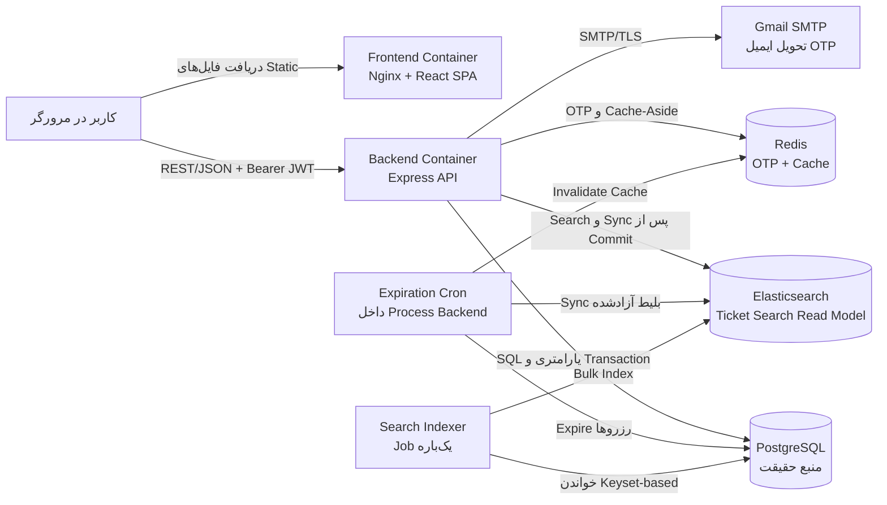
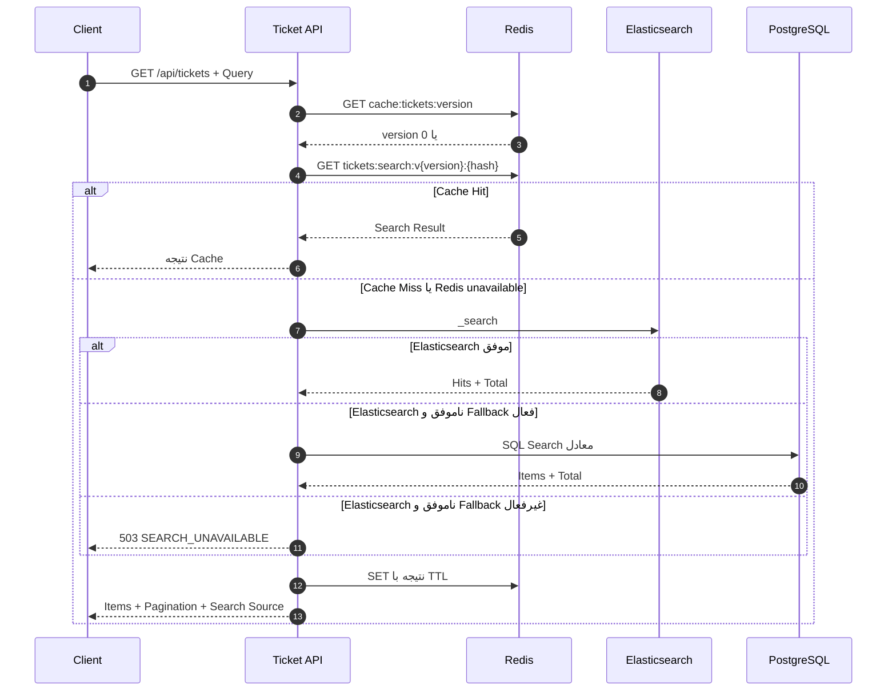
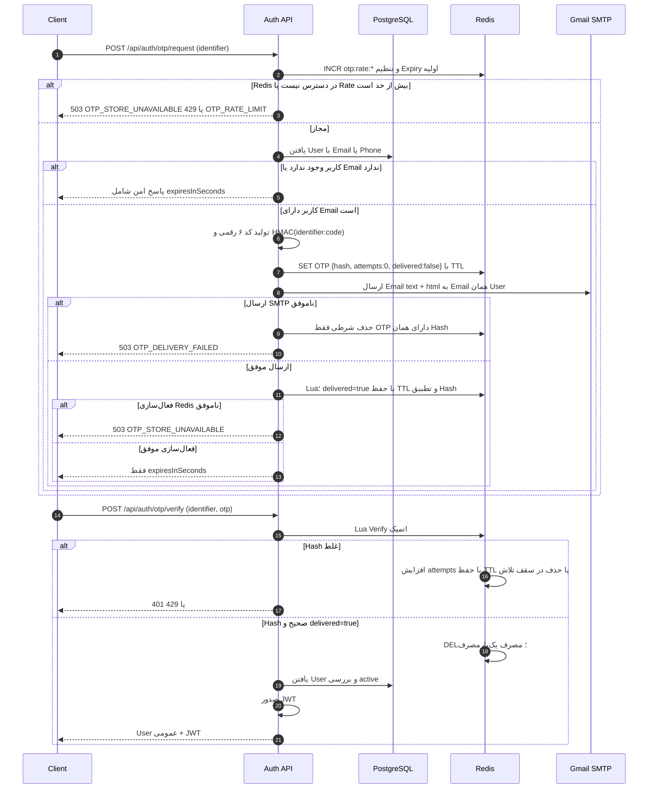
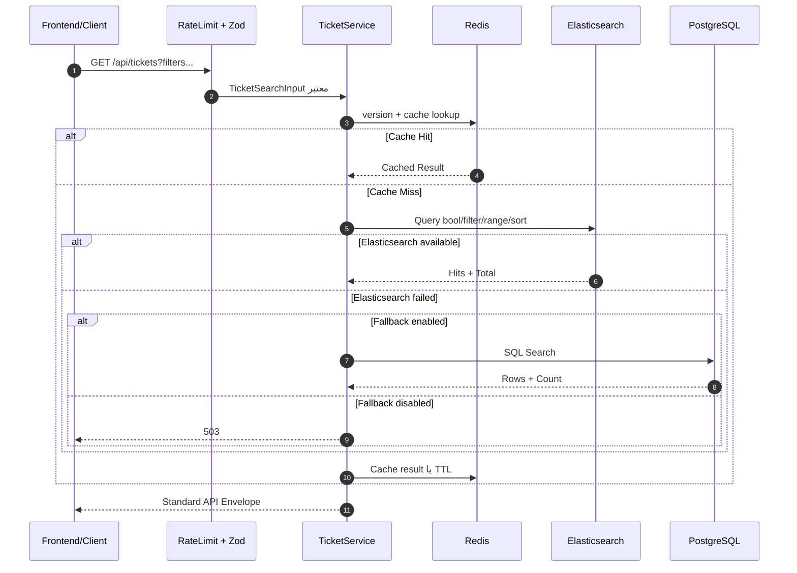
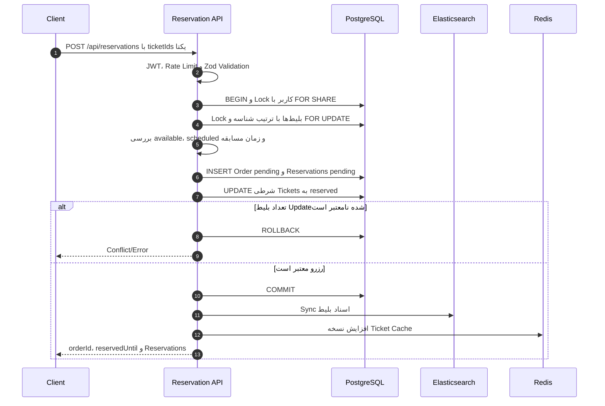
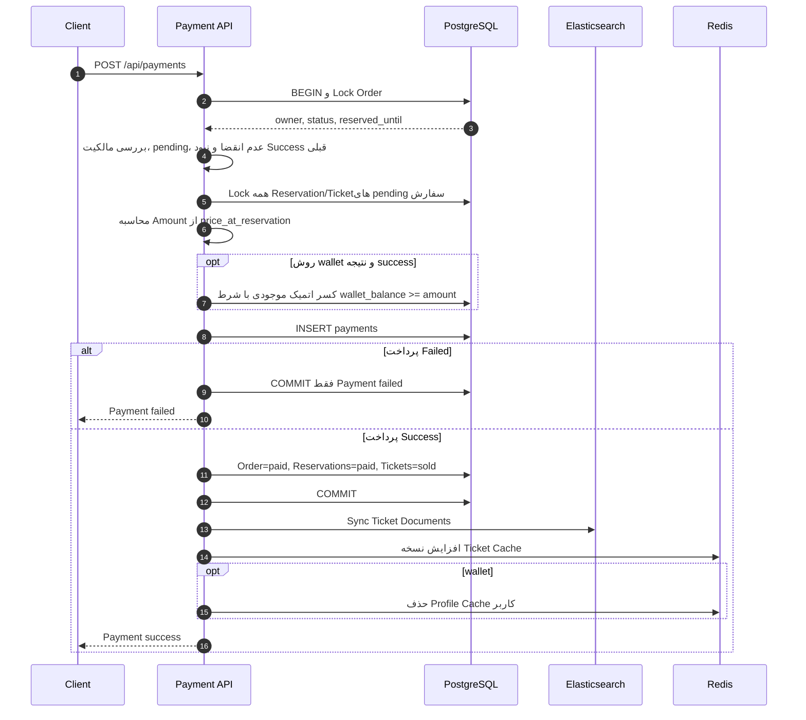
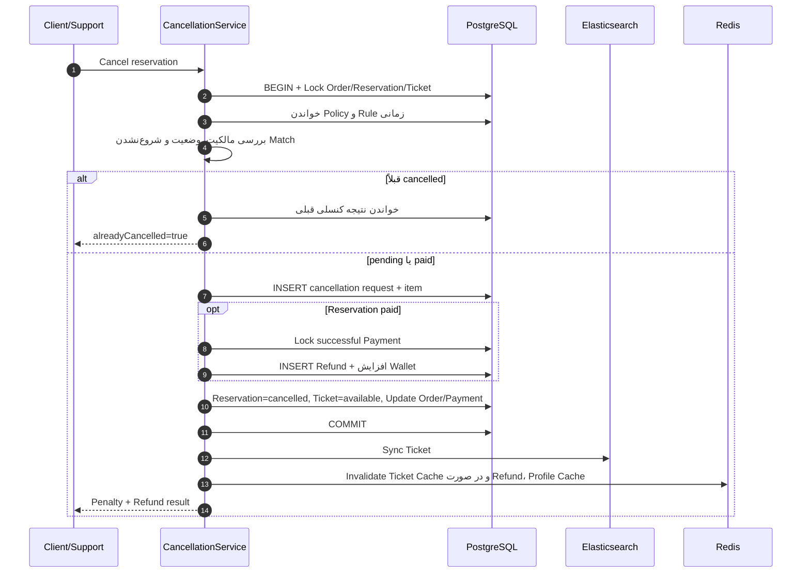
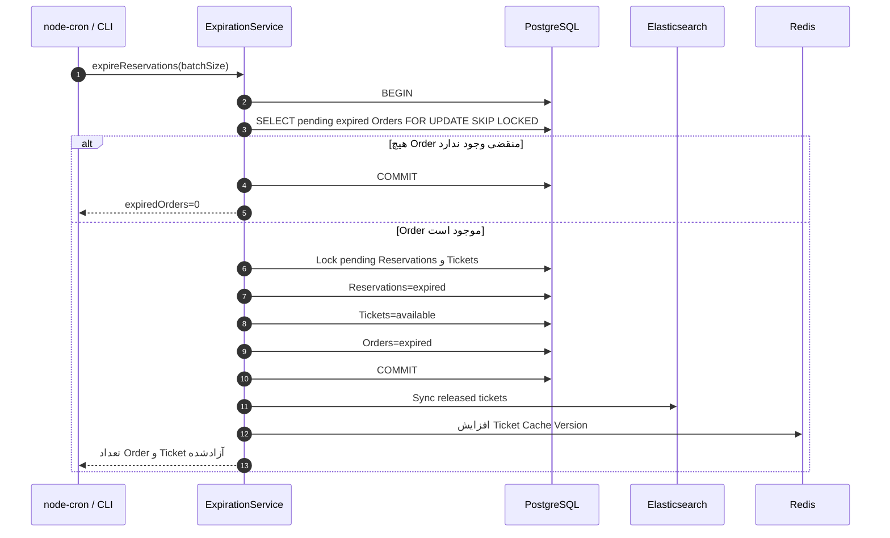

# ‏گزارش جامع معماری سامانه BookTheGame

‏این گزارش با بررسی مستقیم کد TypeScript، فایل‌های SQL، تنظیمات محیط، فایل‌های Docker Compose، کد Frontend و تست‌های موجود در Repository تهیه شده است. مطالب زیر فقط رفتار قابل مشاهده در پیاده‌سازی فعلی را توصیف می‌کنند و قابلیت پیشنهادی یا فرضی به‌عنوان قابلیت موجود معرفی نشده است.

## ‏۱. مقدمه و معرفی معماری پروژه

‏`BookTheGame` یک سامانه رزرو بلیط مسابقات ورزشی با معماری چندسرویسی در زمان اجرا است. Backend با Node.js، TypeScript و Express پیاده‌سازی شده و بدون ORM، مستقیماً از SQL پارامتری و کتابخانه `pg` استفاده می‌کند. PostgreSQL منبع حقیقت تراکنشی سامانه است؛ Redis برای OTP و Cache استفاده می‌شود؛ Elasticsearch نمای جستجوی غیرنرمال‌شده بلیط‌ها را نگه می‌دارد؛ و Frontend یک SPA مبتنی بر React است که فقط با REST API ارتباط دارد.

‏اجزای اصلی عبارت‌اند از:

- ‏Backend لایه‌ای: Route، Middleware/Validator، Controller، Service و Repository.
- ‏PostgreSQL برای کاربران، مسابقات، صندلی‌ها، بلیط‌ها، سفارش‌ها، رزروها، پرداخت‌ها، کنسلی‌ها، Refundها و گزارش‌ها.
- ‏Redis برای OTP، Rate Limit توزیع‌شده OTP و Cache-Aside.
- ‏Elasticsearch برای جستجو، فیلتر، مرتب‌سازی و صفحه‌بندی بلیط‌ها.
- ‏Gmail SMTP از طریق Nodemailer برای تحویل کد تأیید به ایمیل ثبت‌شده کاربر.
- ‏Docker Compose برای اجرای PostgreSQL، Redis، Elasticsearch، Backend، Indexer یک‌باره و Frontend.
- ‏Frontend مبتنی بر React/Vite که JWT را در `localStorage` نگه می‌دارد و از Client مرکزی API استفاده می‌کند.

‏درگاه پرداخت خارجی، Message Broker، Outbox پایدار، Session سمت سرور، Refresh Token، SMS و Audit Log در پیاده‌سازی فعلی پروژه یافت نشد.

## ‏۲. نمای کلی ارتباط سرویس‌ها

‏Frontend هیچ اتصال مستقیمی به PostgreSQL، Redis یا Elasticsearch ندارد. فایل `frontend/nginx.conf` فقط SPA و Assetها را سرو می‌کند و Reverse Proxy برای `/api` تعریف نکرده است؛ بنابراین درخواست API مستقیماً از مرورگر به `VITE_API_BASE_URL` ارسال می‌شود.

### ‏نقش ذخیره‌سازها

| ‏جزء | ‏نقش واقعی | ‏داده مرجع | ‏امکان بازسازی |
|---|---|---|---|
| ‏PostgreSQL | ‏ثبت وضعیت قطعی کسب‌وکار و اجرای تراکنش‌ها | ‏بله | ‏از Backup یا Seed/Migration |
| ‏Redis | ‏OTP، شمارنده درخواست OTP و Cache کوتاه‌عمر | ‏خیر، به‌جز اینکه OTP بدون آن قابل Verify نیست | ‏Cache از منابع اصلی دوباره ساخته می‌شود؛ OTP باید دوباره درخواست شود |
| ‏Elasticsearch | ‏Read Model جستجوی بلیط | ‏خیر | ‏با Reindex از PostgreSQL |

## ‏۳. ساختار و لایه‌های Backend

‏نقطه ساخت Express در `src/app.ts` و نقطه اجرای Process در `src/server.ts` است. `src/server.ts` پس از Listen کردن، اتصال Redis را آغاز می‌کند، وجود Index Elasticsearch را بررسی می‌کند، Job انقضا را راه می‌اندازد و هر ۶۰ ثانیه Syncهای معوق Elasticsearch را Retry می‌کند. هنگام `SIGINT` یا `SIGTERM`، Cron متوقف و اتصال‌های PostgreSQL و Redis بسته می‌شوند.

### ‏لایه‌ها

| ‏لایه | ‏مسئولیت | ‏فایل‌ها/پوشه‌های اصلی |
|---|---|---|
| ‏Config | ‏Parse و Validation متغیرها، Pool دیتابیس، Redis Client | ‏`src/config/env.ts`, `src/config/database.ts`, `src/config/redis.ts` |
| ‏Routes | ‏تعریف Method و URL و زنجیره Middleware | ‏`src/routes/*.ts` |
| ‏Middleware | ‏JWT، نقش پشتیبان، Validation، Rate Limit و Error Handling | ‏`src/middlewares/*.ts` |
| ‏Controllers | ‏تبدیل Request به ورودی Service و ساخت Envelope پاسخ | ‏`src/controllers/*.ts` |
| ‏Services | ‏قواعد کسب‌وکار، Transaction و هماهنگی PostgreSQL/Redis/Elasticsearch | ‏`src/services/*.ts` |
| ‏Repositories | ‏SQL خواندن و نوشتن برای User، Ticket، Reservation و Catalog | ‏`src/repositories/*.ts` |
| ‏Search | ‏Client، Mapping، Query، Reindex و Sync Elasticsearch | ‏`src/search/*.ts` |
| ‏Jobs | ‏اجرای زمان‌بندی‌شده یا دستی انقضای رزرو | ‏`src/jobs/*.ts` |
| ‏Validators | ‏Schemaهای Strict مبتنی بر Zod | ‏`src/validators/*.ts` |
| ‏API Docs | ‏تعریف OpenAPI و Swagger UI | ‏`src/docs/openapi.ts` |

‏همه پاسخ‌های موفق از `src/utils/response.ts` با ساختار `success`, `message`, `data` ساخته می‌شوند. پاسخ خطا در `src/middlewares/errorHandler.ts` با `success=false` و شیء `error` شامل `code` و `details` برمی‌گردد.

### ‏گروه Routeهای واقعی

- ‏عمومی: Health، Signup، OTP، شهرها، محل‌ها، جستجو و جزئیات بلیط.
- ‏احرازشده: پروفایل، رزرو، پرداخت، کنسلی و گزارش‌های کاربر.
- ‏نقش `support`: مدیریت گزارش، رزرو، تغییر بلیط و مشاهده پرداخت‌های مشکوک.
- ‏مستند تعاملی Swagger: `/api/docs`.
- ‏سلامت عمومی: `/health`.
- ‏سلامت Elasticsearch و صف Sync: `/health/search`.

## ‏۴. نحوه اتصال Backend به PostgreSQL

‏اتصال در `src/config/database.ts` با `pg.Pool` ساخته می‌شود. رشته اتصال از `DATABASE_URL` و حداکثر Pool از `DATABASE_POOL_MAX` می‌آید. گزینه اتصال، `search_path` را روی `book_the_game,public` و Timezone را روی UTC قرار می‌دهد. Parser نوع PostgreSQL با OID برابر 1114، مقدار `timestamp without time zone` را طبق قرارداد پروژه به‌صورت UTC به `Date` تبدیل می‌کند.

‏Backend ORM ندارد. Queryها مستقیم و عمدتاً پارامتری هستند. بخش‌های پویا مانند ستون Sort در `src/repositories/ticketRepository.ts` از Map بسته و Whitelist‌شده ساخته می‌شوند، نه از متن آزاد کاربر.

‏تابع عمومی `transaction` در `src/config/database.ts` یک Client اختصاصی از Pool می‌گیرد و به‌ترتیب `BEGIN`، اجرای Work، `COMMIT` و در خطا `ROLLBACK` را انجام می‌دهد؛ Client نیز در `finally` آزاد می‌شود. Isolation Level صریحی تنظیم نشده است، بنابراین پروژه از سطح پیش‌فرض PostgreSQL استفاده می‌کند.

### ‏ساختار Schema

‏Schema اصلی در `create_db.sql` با نام `book_the_game` ساخته می‌شود و از Extension `btree_gist` برای Exclusion Constraint قواعد کنسلی استفاده می‌کند.

| ‏دامنه | ‏جدول‌های اصلی |
|---|---|
| ‏هویت و مکان | ‏`roles`, `provinces`, `cities`, `users`, `support_users` |
| ‏برگزارکننده و ورزش | ‏`organizers`, `sport_types`, `teams`, `venues`, `competitions`, `matches` |
| ‏موجودی بلیط | ‏`ticket_categories`, `seats`, `tickets`, `facilities`, `ticket_facilities` |
| ‏رزرو | ‏`orders`, `reservations` |
| ‏مالی و کنسلی | ‏`payments`, `cancellation_policies`, `cancellation_policy_rules`, `cancellation_requests`, `cancellation_request_items`, `refunds` |
| ‏پشتیبانی | ‏`report_categories`, `reports` |

‏Migration `sql/migrations/001_add_payment_reports.sql` امکان گزارش مستقیم پرداخت را با `payment_id`، Foreign Key مرکب و CHECK «دقیقاً یک موضوع گزارش» اضافه می‌کند. Migration `002_phase3_completeness.sql` ستون‌های `birth_date` و `wallet_balance` را به کاربران و `support_response` را به گزارش‌ها اضافه می‌کند.

‏`stored_procedures.sql` شامل هشت تابع SQL برای گزارش‌گیری و جستجوهای تحلیلی است. در کد `src/` فراخوانی این توابع یافت نشد؛ Backend عملیاتی Queryهای خود را مستقیماً اجرا می‌کند. `analytical_queries.sql` نیز مجموعه Queryهای تحلیلی مستقل است و بخشی از Request Flow زمان اجرا نیست.

‏`sample_data.sql` داده Seed را ایجاد و Sequenceها را با `setval` هماهنگ می‌کند. در Docker، این فایل فقط هنگام Initialize شدن Volume خالی PostgreSQL اجرا می‌شود.

## ‏۵. Transaction، Constraint و کنترل همروندی رزرو

‏کنترل همروندی فقط به بررسی وضعیت در حافظه متکی نیست؛ Lock ردیف، Update شرطی و Constraint دیتابیس هم‌زمان استفاده می‌شوند.

### ‏ایجاد رزرو

‏در `src/services/reservationService.ts` و `src/repositories/reservationRepository.ts`:

1. ‏کاربر با `FOR SHARE` خوانده و فعال بودن او بررسی می‌شود.
2. ‏بلیط‌های خواسته‌شده با `ORDER BY ticket_id FOR UPDATE OF t` قفل می‌شوند.
3. ‏وجود همه بلیط‌ها، وضعیت `available`، وضعیت `scheduled` مسابقه و شروع‌نشدن مسابقه بررسی می‌شود.
4. ‏یک `orders` با وضعیت پیش‌فرض `pending` و `reserved_until` مبتنی بر TTL ساخته می‌شود.
5. ‏برای هر بلیط یک `reservations` با قیمت Snapshot شده در `price_at_reservation` ایجاد می‌شود.
6. ‏وضعیت بلیط‌ها فقط با شرط `status='available'` به `reserved` تغییر می‌کند.
7. ‏اگر تعداد Updateشده با تعداد درخواستی برابر نباشد، Transaction خطا می‌دهد و Rollback می‌شود.

‏مرتب‌سازی Lockها بر اساس شناسه بلیط، احتمال Deadlock میان درخواست‌های چندبلیطی را کاهش می‌دهد. پس از انتظار روی Lock، درخواست دوم وضعیت جدید بلیط را می‌بیند و با Conflict رد می‌شود.

### ‏Constraintهای دفاعی مهم

| ‏Constraint/Index | ‏نقش |
|---|---|
| ‏`UNIQUE(match_id, seat_id)` در `tickets` | ‏یک صندلی در هر مسابقه فقط یک بلیط دارد |
| ‏`uq_active_reservation_per_ticket` | ‏برای هر بلیط حداکثر یک رزرو `pending` یا `paid` |
| ‏`uq_success_payment_per_order` | ‏برای هر سفارش حداکثر یک پرداخت موفق |
| ‏`uq_success_refund_per_cancellation_request` | ‏برای هر درخواست کنسلی حداکثر یک Refund موفق |
| ‏`uq_active_policy_per_organizer_sport` | ‏فقط یک Policy فعال برای برگزارکننده/ورزش |
| ‏`ex_cancellation_policy_rules_no_overlap` | ‏بازه‌های زمانی Ruleهای یک Policy هم‌پوشانی ندارند |
| ‏`uq_active_cancellation_item_per_reservation` | ‏یک Item کنسلی pending/approved فعال برای هر رزرو |

‏Foreign Keyهای مرکب در Schema علاوه بر وجود رکورد، هماهنگی Venue مسابقه و صندلی، Sport تیم‌ها و رقابت، مالکیت Order و ارتباط Reservation/Ticket/Match را کنترل می‌کنند. CHECKها دامنه وضعیت‌ها، قیمت و مبلغ نامنفی، ترتیب زمان رزرو و منطق نوع درخواست کنسلی را اعمال می‌کنند.

### ‏سایر نقاط Lock و Transaction

- ‏پرداخت: Lock سفارش، سپس Reservation و Ticketهای pending سفارش.
- ‏کنسلی: Lock هم‌زمان Order، Reservation و Ticket موضوع کنسلی.
- ‏انقضا: `FOR UPDATE SKIP LOCKED` روی سفارش‌های منقضی و سپس Lock رزروها/بلیط‌ها.
- ‏تغییر بلیط توسط پشتیبان: Lock سفارش، رزرو و هر دو بلیط قدیم و جدید با ترتیب شناسه.
- ‏تغییر وضعیت توسط پشتیبان: Lock سفارش، رزرو و بلیط.

## ‏۶. کاربردهای Redis شامل OTP، Cache و سایر موارد واقعی

‏Redis Client در `src/config/redis.ts` ساخته می‌شود. خطای Redis Log هشدار تولید می‌کند. Helperهای Cache خطا را جذب می‌کنند تا Redis برای عملیات اصلی منبع حقیقت نباشد؛ اما OTP مستقیماً به Redis وابسته است و در نبود آن پاسخ 503 می‌دهد.

### ‏کلیدها و کاربردها

| ‏الگوی کلید | ‏محتوا/نقش | ‏TTL پیش‌فرض |
|---|---|---:|
| ‏`otp:email:<normalized>` یا `otp:phone:<normalized>` | ‏HMAC کد، تعداد تلاش و Flag تحویل | ‏۳۰۰ ثانیه |
| ‏`otp:rate:<namespace>:<identifier>` | ‏شمارنده درخواست OTP | ‏۹۰۰ ثانیه |
| ‏`cache:tickets:version` | ‏نسخه Namespace کش بلیط | ‏بدون TTL |
| ‏`tickets:search:v<version>:<sha256>` | ‏نتیجه کامل جستجو و Pagination | ‏۳۰ ثانیه |
| ‏`tickets:detail:v<version>:<ticketId>` | ‏جزئیات بلیط | ‏۶۰ ثانیه |
| ‏`profile:<userId>` | ‏پروفایل عمومی بدون `password_hash` | ‏۱۲۰ ثانیه |
| ‏`catalog:cities` | ‏فهرست شهرها | ‏۳۰۰ ثانیه |
| ‏`catalog:venues:city:<id/all>` | ‏فهرست محل‌ها | ‏۳۰۰ ثانیه |

‏TTLها از `src/config/env.ts` قابل تنظیم‌اند. کلید Search با `stableCacheKey` در `src/utils/cacheKey.ts` از JSON مرتب‌شده ورودی و SHA-256 ساخته می‌شود؛ بنابراین همه فیلترها، Sort و Pagination در هویت کلید دخیل‌اند.

‏پس از تغییر ظرفیت یا وضعیت بلیط، `cache:tickets:version` افزایش می‌یابد. در نتیجه کلیدهای Search و Detail قبلی دیگر خوانده نمی‌شوند و بعداً با TTL حذف می‌شوند. پس از تغییر پروفایل، پرداخت کیف پول یا Refund، کلید پروفایل همان کاربر حذف می‌شود.

‏Session، JWT blacklist، Pub/Sub، Stream، Queue یا Distributed Lock مبتنی بر Redis در پیاده‌سازی فعلی پروژه یافت نشد. Rate Limit عمومی HTTP نیز Redis-backed نیست و چون Store سفارشی برای `express-rate-limit` تعریف نشده، در حافظه Process Backend نگه‌داری می‌شود. فقط Rate Limit داخلی OTP با شمارنده Redis میان Instanceها قابل اشتراک است.

## ‏۷. ساختار Elasticsearch، Index، Mapping، Search و Reindex

‏Client سفارشی Elasticsearch در `src/search/client.ts` با `fetch` کار می‌کند. URL، Credential اختیاری Basic Auth، Timeout و نام Index از Environment خوانده می‌شوند. نام پیش‌فرض Index `book_the_game_tickets_v1` است.

### ‏Mapping

‏`src/search/mapping.ts` یک Index با مشخصات زیر تعریف می‌کند:

- ‏یک Shard و صفر Replica در تنظیم فعلی پروژه.
- ‏`dynamic: strict` برای جلوگیری از ورود Field تعریف‌نشده.
- ‏Analyzer سفارشی `mixed_text` با `lowercase`، `decimal_digit`، `arabic_normalization` و `persian_normalization`.
- ‏شناسه‌ها، وضعیت‌ها، نوع Venue، صندلی و Facilities به‌صورت `keyword`.
- ‏نام ورزش، رقابت، تیم، شهر، Venue و Category به‌صورت `text` با زیرField `keyword`.
- ‏قیمت با `scaled_float` و Scaling Factor برابر 100.
- ‏تاریخ مسابقه و ایجاد با نوع `date`.
- ‏`remainingCapacity` با نوع Integer و مقدار ۰ یا ۱ بر اساس وضعیت بلیط.

‏هر Document نماینده یک ردیف `tickets` است و `_id` Elasticsearch برابر `ticketId` قرار می‌گیرد. Document از Join جدول‌های بلیط، مسابقه، ورزش، رقابت، تیم‌ها، Venue، شهر، Category، صندلی و Facilities در `src/search/repository.ts` ساخته می‌شود.

### ‏Query جستجو

‏`src/search/ticketSearch.ts` Query را از ورودی Zod-valid شده می‌سازد:

- ‏Full-text روی تیم‌ها، ورزش، رقابت، Venue، شهر و Category با Boostهای مشخص.
- ‏فیلتر Term برای شناسه‌ها، وضعیت و Facility.
- ‏Range برای قیمت و تاریخ.
- ‏در `remainingOnly=true`: بلیط `available`، مسابقه `scheduled` و زمان مسابقه بعد از `now`.
- ‏Sort با Relevance، تاریخ مسابقه، قیمت، زمان ایجاد یا ترتیب عددی شناسه بلیط.
- ‏Pagination با `from` و `size` و `track_total_hits=true`.

### ‏Reindex

‏`src/search/reindex.ts` داده را به‌صورت Keyset-based می‌خواند: `ticket_id > lastTicketId ORDER BY ticket_id LIMIT batchSize`. Batch پیش‌فرض ۵۰۰ است. هر Batch با Bulk API و `refresh=true` Upsert می‌شود و تعداد خوانده‌شده، موفق و ناموفق گزارش می‌شود.

- ‏`search:create-index`: Index را در صورت نبود می‌سازد.
- ‏`search:reindex`: Index موجود را نگه می‌دارد و همه Documentها را Upsert می‌کند.
- ‏`search:rebuild`: Index را حذف، Mapping را دوباره ایجاد و Reindex کامل می‌کند.

‏Elasticsearch در تصمیم رزرو، پرداخت یا مالکیت دخالت ندارد و منبع حقیقت ظرفیت نیست.

## ‏۸. نحوه Sync بین PostgreSQL و Elasticsearch

‏Sync عملیاتی در `src/search/sync.ts` انجام می‌شود. پس از Commit موفق PostgreSQL، Service شناسه بلیط‌های تغییرکرده را ارسال می‌کند. Sync سندهای فعلی را دوباره از PostgreSQL می‌خواند و Bulk Index می‌کند؛ اگر بلیط دیگر در Query PostgreSQL وجود نداشته باشد، Document متناظر حذف می‌شود.

‏نقاط Sync واقعی:

- ‏ایجاد رزرو.
- ‏پرداخت موفق.
- ‏کنسلی.
- ‏انقضای رزرو.
- ‏تغییر وضعیت رزرو توسط پشتیبان.
- ‏تعویض بلیط توسط پشتیبان.

‏PostgreSQL و Elasticsearch Transaction مشترک ندارند. اگر Sync پس از Commit شکست بخورد:

1. ‏تغییر PostgreSQL حفظ می‌شود.
2. ‏شناسه بلیط در یک `Set` درون حافظه Process ثبت می‌شود.
3. ‏خطا بدون OTP، Secret یا داده حساس Log می‌شود.
4. ‏Timer در `src/server.ts` هر ۶۰ ثانیه Retry می‌کند.
5. ‏وضعیت Pending و آخرین خطا از `/health/search` قابل مشاهده است.

‏این صف با Restart از بین می‌رود و Outbox پایدار در پیاده‌سازی فعلی پروژه یافت نشد. مسیر بازیابی قطعی پس از Restart یا تغییر مستقیم SQL، اجرای Reindex است. هنگام Start در Docker، سرویس یک‌باره `search-indexer` پیش از Backend یک Reindex کامل اجرا می‌کند.

## ‏۹. جریان Cache بین Redis و Elasticsearch

‏Redis قبل از Elasticsearch قرار می‌گیرد؛ بنابراین Cache Hit هیچ Query به Elasticsearch یا PostgreSQL نمی‌فرستد. در Mutation بلیط، پس از Commit و تلاش Sync، نسخه کش افزایش می‌یابد. اگر افزایش نسخه به‌علت قطع Redis شکست بخورد، داده Cache قدیمی حداکثر تا TTL خود ممکن است باقی بماند؛ Helperها عمداً عملیات PostgreSQL را Fail نمی‌کنند.

## ‏۱۰. معماری Docker، Containerها، Portها، Network و Volumeها

‏`docker-compose.yml` شش Service تعریف می‌کند. نام Network صریح تعیین نشده و Docker Compose یک Network پیش‌فرض برای Project می‌سازد؛ Serviceها از DNS داخلی مانند `postgres`, `redis` و `elasticsearch` استفاده می‌کنند.

| ‏Service | ‏Role | ‏Container Port | ‏Host Port | ‏Dependencies |
|---|---|---:|---:|---|
| ‏`postgres` | ‏PostgreSQL و اجرای Init SQL | ‏5432 | ‏5432 | ‏ندارد |
| ‏`redis` | ‏OTP و Cache | ‏6379 | ‏6379 | ‏ندارد |
| ‏`elasticsearch` | ‏Index جستجوی بلیط | ‏9200 | ‏9200 | ‏ندارد |
| ‏`search-indexer` | ‏Reindex یک‌باره پیش از Backend | ‏Port شنونده ندارد | ‏ندارد | ‏PostgreSQL healthy، Elasticsearch healthy |
| ‏`backend` | ‏Express API و Cron انقضا | ‏3000 | ‏3000 | ‏PostgreSQL healthy، Redis healthy، Elasticsearch healthy، پایان موفق Indexer |
| ‏`frontend` | ‏Nginx و فایل‌های Buildشده React | ‏80 | ‏5173 | ‏Backend started |

### ‏Volumeها و Initialization

- ‏`postgres_data` روی `/var/lib/postgresql/data` پایدار است.
- ‏`elasticsearch_data` روی `/usr/share/elasticsearch/data` پایدار است.
- ‏Redis Volume ندارد؛ داده آن با حذف Container از بین می‌رود.
- ‏Schema، Indexها، Seed، Stored Procedure و Migrationها به‌صورت Read-only در `/docker-entrypoint-initdb.d` با ترتیب 01 تا 06 Mount می‌شوند.
- ‏Init SQL فقط هنگام خالی بودن Volume PostgreSQL اجرا می‌شود.

‏Backend از Dockerfile چندمرحله‌ای Node 22 Alpine ساخته می‌شود. Stage اول TypeScript را Build می‌کند و Stage Runtime فقط Dependencyهای Production و `dist` را دارد. `search-indexer` از همان Image استفاده می‌کند ولی Command آن `search:reindex:prod` است.

‏Frontend نیز Build چندمرحله‌ای دارد: Node/Vite خروجی Static را می‌سازد و Nginx 1.27 آن را سرو می‌کند. `try_files` تمام Routeهای ناشناخته را به `index.html` برمی‌گرداند تا BrowserRouter کار کند.

‏`docker-compose.qa.yml` Portهای Host را به‌ترتیب به 15432، 16379، 19200، 13000 و 15173 منتقل و محدودیت‌های Rate Limit و Environment تست را Override می‌کند.

‏در Compose اصلی، Backend در Start اولیه عملاً به Healthy بودن Redis و Elasticsearch وابسته است؛ هرچند کد در قطعی زمان اجرا برای Cache و Search رفتار Degraded دارد. شکست `search-indexer` نیز مانع Start شدن Backend می‌شود.

## ‏۱۱. JWT، OTP و ارسال Email با Gmail SMTP

### ‏JWT و Signup

‏Signup در `src/services/authService.ts` تماس تکراری را بررسی، Password را با bcrypt و Cost برابر 12 Hash، کاربر spectator را ایجاد و بلافاصله JWT صادر می‌کند. Password Login Route در پیاده‌سازی فعلی یافت نشد؛ Login موجود از OTP استفاده می‌کند. JWT شامل `userId` و `role` است، با `JWT_SECRET` امضا و با `JWT_EXPIRES_IN` منقضی می‌شود.

‏Middleware احراز هویت در `src/middlewares/auth.ts` فقط Payload JWT را قبول نمی‌کند؛ پس از Verify، کاربر را دوباره از PostgreSQL می‌خواند و وجود، وضعیت `active` و نقش جاری دیتابیس را بررسی می‌کند. Refresh Token، Token Revocation و Logout سمت سرور در پیاده‌سازی فعلی پروژه یافت نشد.

### ‏جریان OTP و Email

‏خود کد OTP در Redis ذخیره نمی‌شود؛ HMAC آن با `OTP_HASH_SECRET` ذخیره می‌شود. Lua Script بررسی، افزایش تعداد تلاش و حذف پس از موفقیت را اتمیک انجام می‌دهد؛ بنابراین دو Verify هم‌زمان نمی‌توانند یک کد را مصرف کنند.

‏اگر Request با شماره تلفن انجام شود ولی کاربر ایمیل ثبت‌شده داشته باشد، کد به ایمیل همان کاربر فرستاده می‌شود و کلید OTP در Namespace تلفن قرار می‌گیرد. اگر کاربر ایمیل نداشته باشد، پاسخ امن بازگردانده می‌شود ولی کدی تولید/ارسال نمی‌شود.

‏`src/services/emailService.ts` در محیط عادی Nodemailer را با `SMTP_HOST`, `SMTP_PORT`, `SMTP_SECURE`, `SMTP_USER` و `SMTP_PASS` می‌سازد. تنظیم نمونه Gmail از Host رسمی SMTP، Port 587، `secure=false` و TLS اجباری استفاده می‌کند. App Password باید فقط از Environment در `SMTP_PASS` وارد شود. Email دارای نسخه Text و HTML، عنوان سامانه، کد، مدت اعتبار واقعی و پیام نادیده‌گرفتن درخواست ناخواسته است.

‏در `NODE_ENV=test` از `jsonTransport` استفاده می‌شود و اتصال واقعی Gmail انجام نمی‌گیرد. Retry، Queue یا Provider جایگزین SMTP در پیاده‌سازی فعلی یافت نشد.

‏کد OTP در Response، URL یا Log برگردانده نمی‌شود. متغیر `EXPOSE_DEV_OTP` در نسخه فعلی `docker-compose.yml` تنظیم شده است، اما در `src/config/env.ts` و منطق پاسخ OTP مصرف‌کننده‌ای برای آن یافت نشد و اثر اجرایی ندارد.

## ‏۱۲. Flow کامل جستجوی بلیط

1. ‏Client درخواست عمومی `GET /api/tickets` را می‌فرستد.
2. ‏`searchRateLimiter` محدودیت HTTP را اعمال می‌کند.
3. ‏`ticketSearchSchema` Query را به‌صورت Strict اعتبارسنجی و Defaultهای `remainingOnly=true`, `page=1`, `limit=20` را اعمال می‌کند.
4. ‏Service نسخه Cache بلیط را از Redis می‌خواند و کلید پایدار می‌سازد.
5. ‏در Cache Hit، نتیجه بدون تماس با موتور جستجو برمی‌گردد.
6. ‏در Cache Miss، Query Elasticsearch ساخته و اجرا می‌شود.
7. ‏در موفقیت، Hitها به Contract API تبدیل می‌شوند.
8. ‏در شکست Elasticsearch، اگر `SEARCH_FALLBACK_TO_POSTGRES=true` باشد، `searchTickets` در Repository همان فیلترهای اصلی، Sort و Pagination را با SQL اجرا می‌کند؛ در غیر این صورت 503 برمی‌گردد.
9. ‏نتیجه با TTL در Redis ذخیره می‌شود.
10. ‏پاسخ شامل Items، Pagination و `search.source` است. در غیر Production، `cacheHit` نیز افزوده می‌شود.

‏Endpoint جزئیات `GET /api/tickets/:ticketId` از Elasticsearch استفاده نمی‌کند؛ پس از Cache Miss، جزئیات را مستقیماً از PostgreSQL می‌خواند و در Redis Cache می‌کند.

## ‏۱۳. Flow کامل رزرو

1. ‏Client احرازشده حداکثر ۱۰ `ticketIds` یکتا می‌فرستد.
2. ‏JWT، فعال بودن کاربر، Rate Limit و Zod بررسی می‌شوند.
3. ‏Transaction PostgreSQL آغاز می‌شود.
4. ‏User با `FOR SHARE` و Ticketها با `FOR UPDATE` قفل می‌شوند.
5. ‏فقط بلیط `available` متعلق به مسابقه `scheduled` که هنوز شروع نشده قابل رزرو است.
6. ‏یک Order pending و یک Reservation pending برای هر بلیط ساخته می‌شود.
7. ‏قیمت در Reservation Snapshot می‌شود و Ticket به `reserved` تغییر می‌کند.
8. ‏Transaction Commit می‌شود.
9. ‏Document بلیط‌ها در Elasticsearch Sync می‌شود.
10. ‏نسخه Cache بلیط در Redis افزایش می‌یابد.
11. ‏پاسخ `orderId`, `reservedUntil` و Reservationها را برمی‌گرداند.

‏PostgreSQL منبع تصمیم است؛ اگر Sync یا Cache پس از Commit شکست بخورد، رزرو معتبر باقی می‌ماند.

## ‏۱۴. Flow پرداخت

‏پرداخت از `POST /api/payments` و `src/services/paymentService.ts` عبور می‌کند. ورودی شامل یک `reservationId`، روش پرداخت و وضعیت شبیه‌سازی است؛ Service از Reservation به Order می‌رسد و کل سفارش را پرداخت می‌کند.

‏مبلغ از Client پذیرفته نمی‌شود و از مجموع `price_at_reservation` آیتم‌های pending محاسبه می‌شود. در پرداخت موفق کیف پول، کسر موجودی با یک `UPDATE ... WHERE wallet_balance >= amount` در همان Transaction انجام می‌شود.

‏`simulateStatus=FAILED` در Production رد می‌شود. اتصال واقعی به بانک، شبکه کارت یا Provider رمزارز در پیاده‌سازی فعلی پروژه یافت نشد؛ حتی روش‌های `bank_card` و `crypto` در حال حاضر رکورد محلی با Transaction Code تولیدشده توسط Backend می‌سازند.

## ‏۱۵. Flow کنسلی

‏Preview و اجرای کنسلی در `src/services/cancellationService.ts` قرار دارد:

1. ‏Reservation به Order، Ticket و Match Join می‌شود.
2. ‏مالکیت بررسی می‌شود؛ نقش `support` می‌تواند از محدودیت مالک عبور کند.
3. ‏Policy فعال بر اساس Organizer و Sport انتخاب می‌شود.
4. ‏Rule مطابق فاصله زمانی تا مسابقه با LATERAL Query انتخاب می‌شود.
5. ‏اگر Rule فعال پیدا نشود، جریمه صفر است.
6. ‏مسابقه شروع‌شده قابل کنسلی نیست.
7. ‏در اجرای Cancel، Order/Reservation/Ticket قفل می‌شوند.
8. ‏یک `cancellation_requests` و یک `cancellation_request_items` با وضعیت `approved` ایجاد می‌شود.
9. ‏برای Reservation پرداخت‌شده، Payment موفق قفل، Refund موفق ثبت و مبلغ قابل استرداد به کیف پول کاربر افزوده می‌شود.
10. ‏Reservation به `cancelled` و Ticket به `available` تغییر می‌کند.
11. ‏وضعیت Order بر اساس Reservationهای باقی‌مانده به `pending`, `partially_cancelled` یا `cancelled` تبدیل می‌شود.
12. ‏اگر هیچ آیتم فعال باقی نماند، Payment موفق به `refunded` تغییر می‌کند.
13. ‏پس از Commit، Elasticsearch Sync، Cache بلیط invalid و در Refund، Cache پروفایل حذف می‌شود.

‏Refund خارجی به Provider پرداخت انجام نمی‌شود؛ رکورد `refunds` و اعتبار کیف پول، رفتار فعلی پروژه است.

## ‏۱۶. Flow انقضای رزرو

‏Job در `src/jobs/expirationJob.ts` هنگام Start سرور فعال می‌شود. Cron و Batch Size از Environment می‌آیند؛ مقادیر پیش‌فرض به‌ترتیب هر یک دقیقه و ۱۰۰ سفارش هستند. اجرای مستقل همان Batch با `src/jobs/runExpirationJob.ts` و Script `job:expire` ممکن است.

1. ‏سفارش‌های `pending` با `reserved_until <= CURRENT_TIMESTAMP` انتخاب می‌شوند.
2. ‏`LIMIT` و `FOR UPDATE SKIP LOCKED` امکان پردازش Batch و اجرای هم‌زمان Workerها را فراهم می‌کند.
3. ‏Reservationهای pending و Ticketهای مربوط قفل می‌شوند.
4. ‏Reservationها `expired`، Ticketهای `reserved` دوباره `available` و Orderها `expired` می‌شوند.
5. ‏Transaction Commit می‌شود.
6. ‏Ticketهای آزادشده در Elasticsearch Sync و نسخه Cache افزایش می‌یابد.

## ‏۱۷. رفتار سیستم هنگام قطع PostgreSQL، Redis، Elasticsearch یا SMTP

| ‏خرابی | ‏رفتار زمان Start در Compose | ‏رفتار زمان اجرای Backend |
|---|---|---|
| ‏PostgreSQL | ‏Backend و Indexer تا Healthy شدن PostgreSQL Start نمی‌شوند | ‏Writeها و Queryهای وابسته شکست می‌خورند؛ Transaction Rollback می‌شود. خطای اتصال معمولاً به خطای عمومی 500 نگاشت می‌شود. Search عمومی ممکن است از Cache یا Elasticsearch پاسخ دهد، اما Route محافظت‌شده برای Authentication به PostgreSQL نیاز دارد. |
| ‏Redis | ‏Backend طبق `depends_on` تا Healthy شدن Redis Start نمی‌شود | ‏Cacheها به Miss/No-op تبدیل می‌شوند و عملیات PostgreSQL ادامه می‌یابد؛ OTP Request/Verify با 503 شکست می‌خورند. اتصال مجدد Client ممکن است Request را تا Timeout/Reconnect معطل کند. |
| ‏Elasticsearch | ‏Indexer و سپس Backend تا Healthy شدن آن Start نمی‌شوند | ‏Search در صورت فعال بودن Fallback به PostgreSQL می‌رود؛ در غیر این صورت 503. Write PostgreSQL Commit می‌شود و Sync در صف حافظه قرار می‌گیرد. |
| ‏SMTP | ‏Dependency یا Healthcheck جداگانه در Compose ندارد | ‏فقط تحویل OTP شکست می‌خورد. OTP همان درخواست شرطی حذف می‌شود؛ اگر حذف هم شکست بخورد، `delivered=false` مانع Verify شدن آن است و TTL باقی می‌ماند. پاسخ 503 است. سایر Flowها ادامه دارند. |

‏`/health` فقط سلامت Process Express را اعلام می‌کند و PostgreSQL/Redis را Probe نمی‌کند. `/health/search` فقط Elasticsearch و وضعیت Sync درون‌حافظه‌ای را گزارش می‌کند. Health Endpoint جامع همه Dependencyها در پیاده‌سازی فعلی پروژه یافت نشد.

‏نکات بازیابی:

- ‏Redis Cache قابل بازسازی است؛ OTP باید دوباره درخواست شود.
- ‏Elasticsearch با `search:reindex` یا `search:rebuild` از PostgreSQL بازسازی می‌شود.
- ‏PostgreSQL منبع حقیقت است و Fallback دیگری برای داده تراکنشی ندارد.
- ‏SMTP Retry یا صف تحویل ایمیل وجود ندارد.

## ‏۱۸. امنیت، Validation، Rate Limit، Role و Ownership

### ‏کنترل‌های HTTP و ورودی

- ‏`helmet` Headerهای امنیتی را فعال می‌کند.
- ‏`x-powered-by` غیرفعال است.
- ‏CORS فقط Originهای `CORS_ORIGIN` را می‌پذیرد و `credentials=false` است.
- ‏Body JSON با `BODY_LIMIT` محدود می‌شود.
- ‏Zod Schemaها عمدتاً `strict()` هستند؛ Mass Assignment ناشی از Field اضافی رد می‌شود.
- ‏شناسه‌ها Integer مثبت و Pagination حداکثر ۱۰۰ است.
- ‏تاریخ و Range قیمت اعتبارسنجی متقابل دارند.
- ‏Queryهای SQL با Parameter Binding اجرا می‌شوند.
- ‏Error Handler جزئیات Stack را در Production برنمی‌گرداند و خطاهای Unique/FK/CHECK را به خطای کنترل‌شده نگاشت می‌کند.

### ‏Rate Limit

- ‏Auth: پنجره ۱۵ دقیقه.
- ‏Search: پنجره یک دقیقه.
- ‏Reservation و Payment: پنجره ۱۵ دقیقه.
- ‏سقف‌ها از Environment می‌آیند.
- ‏Store سفارشی تعریف نشده و Rate Limit HTTP در حافظه هر Process است.
- ‏OTP علاوه بر Rate Limit HTTP، شمارنده Redis با پنجره و سقف مستقل دارد.

### ‏نقش و مالکیت

- ‏نقش‌های Schema فقط `spectator` و `support` هستند.
- ‏`authenticate` JWT را Verify و User فعال را دوباره از PostgreSQL می‌خواند.
- ‏`requireSupport` همه Routeهای `/api/admin` را محدود می‌کند.
- ‏پرداخت فقط برای مالک Order مجاز است.
- ‏Preview و کنسلی فقط برای مالک یا Support مجاز است.
- ‏گزارش Reservation یا Payment فقط برای مالک پذیرفته می‌شود؛ گزارش مستقیم Ticket تنها وجود Ticket را بررسی می‌کند.
- ‏تغییر پروفایل فقط روی User استخراج‌شده از JWT انجام می‌شود.
- ‏تغییر بلیط توسط Support فقط برای Order pending و منقضی‌نشده و به بلیط available همان Match مجاز است.

### ‏نگه‌داری Secret و Token

- ‏Config با Zod، حداقل طول JWT و OTP Secret را کنترل می‌کند.
- ‏Credential SMTP و Elasticsearch از Environment خوانده می‌شوند.
- ‏کد OTP و Password Hash در پاسخ عمومی User قرار نمی‌گیرند.
- ‏Frontend JWT را در `localStorage` نگه می‌دارد و روی پاسخ 401 حذف می‌کند.
- ‏TLS termination در `docker-compose.yml` یا `frontend/nginx.conf` تعریف نشده است؛ محیط Local با HTTP کار می‌کند.
- ‏Elasticsearch در Compose با Security غیرفعال اجرا می‌شود و تنظیم فعلی برای محیط توسعه/آزمایش است.
- ‏Secret rotation، Refresh Token، Token Revocation و Audit Log در پیاده‌سازی فعلی پروژه یافت نشد.

## ‏۱۹. ارتباط Frontend با Backend در سطح معماری

‏Frontend در `frontend/` یک React SPA با Vite و React Router است. `frontend/src/api/client.ts` تنها نقطه عمومی ارتباط HTTP است:

1. ‏Base URL را از `VITE_API_BASE_URL` می‌خواند.
2. ‏برای Body، Header JSON و برای همه درخواست‌ها `Accept: application/json` می‌گذارد.
3. ‏JWT موجود در `localStorage` را با `Authorization: Bearer` ارسال می‌کند.
4. ‏Timeout را با `AbortSignal.timeout` اعمال می‌کند.
5. ‏Envelope موفق/خطا را Parse می‌کند.
6. ‏در 401، Token را حذف و Event انقضای Auth صادر می‌کند.

‏`frontend/src/api/endpoints.ts` Contractهای Routeهای Backend را در توابع TypeScript جمع کرده است. `AuthContext` پس از Load، در صورت وجود Token، `/api/users/me` را فراخوانی می‌کند. `ProtectedRoute` فقط وجود User و `SupportRoute` نقش `support` را در UI بررسی می‌کند؛ امنیت قطعی همچنان در Middleware Backend اعمال می‌شود.

‏صفحات Search، جزئیات بلیط، Signup/OTP، رزرو، پرداخت، تاریخچه/کنسلی، پروفایل، گزارش و پنل Support از همین API Client استفاده می‌کنند. Frontend به Redis، PostgreSQL و Elasticsearch دسترسی مستقیم ندارد. Service Worker، SSR و Proxy API در Nginx فعلی یافت نشد.

## ‏۲۰. جمع‌بندی

‏معماری فعلی بر تفکیک مسئولیت روشن استوار است: PostgreSQL تمام تصمیم‌های تراکنشی را نگه می‌دارد، Redis سرعت و OTP را تأمین می‌کند، و Elasticsearch جستجوی قابل‌بازسازی را ارائه می‌دهد. Transactionها، Row Lockها و Constraintهای PostgreSQL، هسته کنترل همروندی رزرو و پرداخت هستند. Cache و Sync بعد از Commit اجرا می‌شوند تا خرابی سرویس‌های کمکی باعث Rollback شدن داده معتبر PostgreSQL نشود.

‏مهم‌ترین خصوصیات عملی معماری عبارت‌اند از:

- ‏PostgreSQL تنها منبع حقیقت و Elasticsearch صرفاً Read Model است.
- ‏رزرو با Lock، Update شرطی و Unique Index از فروش هم‌زمان جلوگیری می‌کند.
- ‏OTP به Redis و SMTP وابسته و یک‌بارمصرف است؛ Cacheهای دیگر در قطع Redis Degrade می‌شوند.
- ‏Search ابتدا Redis، سپس Elasticsearch و در خطا PostgreSQL را بررسی می‌کند.
- ‏Sync Elasticsearch بعد از Commit و با Retry درون‌حافظه‌ای انجام می‌شود.
- ‏Docker Compose ترتیب Init دیتابیس، Reindex و Start Backend را کنترل می‌کند.
- ‏Frontend فقط REST API را می‌شناسد و زیرساخت داده برای آن پنهان است.

‏محدودیت‌های قطعی پیاده‌سازی فعلی شامل نبود Outbox پایدار، نبود درگاه پرداخت خارجی، نبود Retry Queue ایمیل، نبود Healthcheck جامع Dependencyها و نبود مکانیزم Refresh/Revocation JWT است.

## ‏فایل‌های اصلی بررسی‌شده

### ‏Backend و تنظیمات

- ‏`src/server.ts`
- ‏`src/app.ts`
- ‏`src/config/env.ts`
- ‏`src/config/database.ts`
- ‏`src/config/redis.ts`
- ‏`src/routes/*.ts`
- ‏`src/controllers/*.ts`
- ‏`src/middlewares/auth.ts`
- ‏`src/middlewares/rateLimit.ts`
- ‏`src/middlewares/validate.ts`
- ‏`src/middlewares/errorHandler.ts`
- ‏`src/validators/*.ts`
- ‏`src/repositories/*.ts`
- ‏`src/services/authService.ts`
- ‏`src/services/emailService.ts`
- ‏`src/services/tokenService.ts`
- ‏`src/services/ticketService.ts`
- ‏`src/services/reservationService.ts`
- ‏`src/services/paymentService.ts`
- ‏`src/services/cancellationService.ts`
- ‏`src/services/expirationService.ts`
- ‏`src/services/adminService.ts`
- ‏`src/services/reportService.ts`
- ‏`src/services/userService.ts`
- ‏`src/services/catalogService.ts`
- ‏`src/jobs/expirationJob.ts`
- ‏`src/jobs/runExpirationJob.ts`
- ‏`src/docs/openapi.ts`

### ‏Elasticsearch

- ‏`src/search/client.ts`
- ‏`src/search/indexManager.ts`
- ‏`src/search/mapping.ts`
- ‏`src/search/repository.ts`
- ‏`src/search/ticketSearch.ts`
- ‏`src/search/reindex.ts`
- ‏`src/search/sync.ts`
- ‏`src/search/scripts/*.ts`

### ‏PostgreSQL و داده

- ‏`create_db.sql`
- ‏`indexes.sql`
- ‏`sample_data.sql`
- ‏`stored_procedures.sql`
- ‏`analytical_queries.sql`
- ‏`sql/migrations/001_add_payment_reports.sql`
- ‏`sql/migrations/002_phase3_completeness.sql`
- ‏`sql/README.md`
- ‏`relational_model.md`

### ‏Docker و Environment

- ‏`Dockerfile`
- ‏`docker-compose.yml`
- ‏`docker-compose.qa.yml`
- ‏`.env.example`
- ‏`package.json`

### ‏Frontend در سطح معماری

- ‏`frontend/Dockerfile`
- ‏`frontend/nginx.conf`
- ‏`frontend/.env.example`
- ‏`frontend/package.json`
- ‏`frontend/src/api/client.ts`
- ‏`frontend/src/api/endpoints.ts`
- ‏`frontend/src/context/AuthContext.tsx`
- ‏`frontend/src/routes/guards.tsx`
- ‏`frontend/src/App.tsx`
- ‏`frontend/src/main.tsx`
- ‏`frontend/src/types/api.ts`

### ‏تست‌ها و مستندات تطبیقی

- ‏`tests/e2e/phase4-live.ts`
- ‏`tests/e2e/phase4-security-live.ts`
- ‏`tests/e2e/phase4-failure-live.ts`
- ‏`tests/concurrency/reservation-concurrency.ts`
- ‏`tests/sql/phase4-constraints.sql`
- ‏`docs/phase4-architecture.md`
- ‏`docs/phase4-api.md`
- ‏`README.md`
