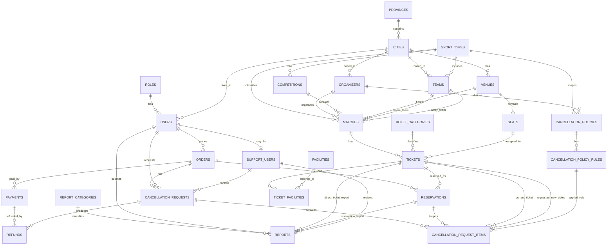

# ERD با Mermaid

```mermaid
erDiagram
    ROLES ||--o{ USERS : has
    USERS ||--o| SUPPORT_USERS : may_be
    PROVINCES ||--o{ CITIES : contains
    CITIES ||--o{ USERS : lives_in
    CITIES ||--o{ ORGANIZERS : based_in
    CITIES ||--o{ TEAMS : based_in
    CITIES ||--o{ VENUES : has

    SPORT_TYPES ||--o{ TEAMS : includes
    SPORT_TYPES ||--o{ COMPETITIONS : has
    SPORT_TYPES ||--o{ MATCHES : classifies
    SPORT_TYPES ||--o{ CANCELLATION_POLICIES : scopes

    ORGANIZERS ||--o{ MATCHES : organizes
    ORGANIZERS ||--o{ CANCELLATION_POLICIES : defines

    COMPETITIONS ||--o{ MATCHES : contains
    VENUES ||--o{ MATCHES : hosts
    VENUES ||--o{ SEATS : contains

    TEAMS ||--o{ MATCHES : home_team
    TEAMS ||--o{ MATCHES : away_team

    MATCHES ||--o{ TICKETS : has
    TICKET_CATEGORIES ||--o{ TICKETS : classifies
    SEATS ||--o{ TICKETS : assigned_to

    USERS ||--o{ ORDERS : places
    ORDERS ||--o{ RESERVATIONS : contains
    TICKETS ||--o{ RESERVATIONS : reserved_as

    ORDERS ||--o{ PAYMENTS : paid_by

    CANCELLATION_POLICIES ||--o{ CANCELLATION_POLICY_RULES : has
    ORDERS ||--o{ CANCELLATION_REQUESTS : has
    USERS ||--o{ CANCELLATION_REQUESTS : requests
    SUPPORT_USERS ||--o{ CANCELLATION_REQUESTS : reviews
    CANCELLATION_REQUESTS ||--o{ CANCELLATION_REQUEST_ITEMS : contains
    RESERVATIONS ||--o{ CANCELLATION_REQUEST_ITEMS : targets
    TICKETS ||--o{ CANCELLATION_REQUEST_ITEMS : current_ticket
    TICKETS ||--o{ CANCELLATION_REQUEST_ITEMS : requested_new_ticket
    CANCELLATION_POLICY_RULES ||--o{ CANCELLATION_REQUEST_ITEMS : applied_rule

    PAYMENTS ||--o{ REFUNDS : refunded_by
    CANCELLATION_REQUESTS ||--o{ REFUNDS : produces

    REPORT_CATEGORIES ||--o{ REPORTS : classifies
    USERS ||--o{ REPORTS : submits
    TICKETS ||--o{ REPORTS : direct_ticket_report
    RESERVATIONS ||--o{ REPORTS : reservation_report
    SUPPORT_USERS ||--o{ REPORTS : reviews

    TICKETS ||--o{ TICKET_FACILITIES : has
    FACILITIES ||--o{ TICKET_FACILITIES : belongs_to
```
